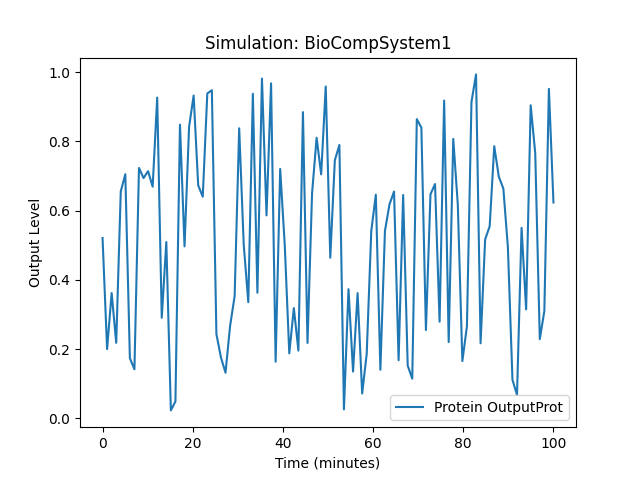
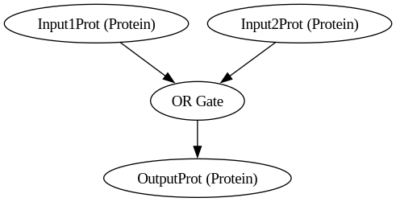
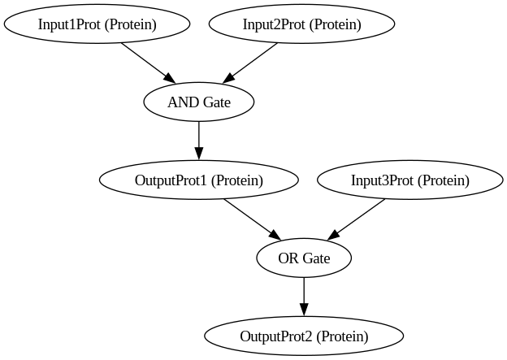
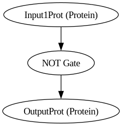
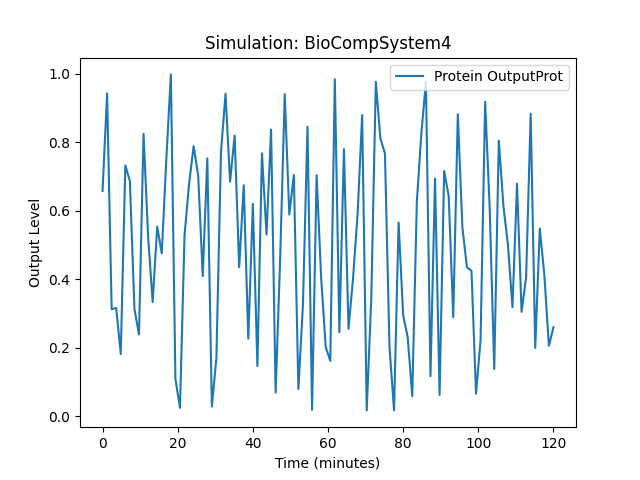

[BioComp "Coded Life"](https://dsl.biokomputery.pl/) to propozycja języka domenowo-specyficznego (DSL) do edukacji i wdrażania biocomputingu obejmuje elementy języka opisu eksperymentów, symulacji, designu i utrzymania systemów biokomputerowych. 
Motto "Coded Life" Łączy w sobie koncepcję kodowania (nawiązując do aspektu programistycznego) z życiem (odnosząc się do biologicznej strony projektu).


### Składnia języka

**BioComp** jest zaimplementowany jako skrypt jezyka python z klasami dla modelu i funkcjami przetwarzania pliku **YAML**, generowania symulacji i grafu. 
Plik `biocomp.py` modelu jest konwertowany do obiektow klas potrzebnyh do uruchamienia symulacji.
Plik **YAML** zawiera potrzebne informacje do wykonania symulacji:
1. Definicje Molekularne
2. Tworzenie Biologicznych Układów Logicznych
3. Symulacje Eksperymentów
4. Drukowanie i Inżynieria BioSystemów
5. Monitorowanie i Utrzymanie Systemów


**Wzór Przetwarzania Danych Wejściowych:**

- **Poziom Wyjściowy:** 


```python
def run_simulation(simulation):
    time = np.linspace(0, float(simulation.conditions["time"]), 100)  # Generowanie 100 punktów czasowych
    output_levels = np.sin(time) / 2 + 0.5  # Przykładowa funkcja poziomu wyjściowego    
```


```latex
\[ \text{output\_level} = \frac{\sin(t)}{2} + 0.5 \]
```

### Symulacja bramki AND

```yaml
molecules:
  - type: Protein
    name: Input1Prot
  - type: Protein
    name: Input2Prot
  - type: Protein
    name: OutputProt

logic_gates:
  - gate_type: AND
    input1: Input1Prot
    input2: Input2Prot
    output: OutputProt

biological_system:
  name: BioCompSystem1

simulation:
  conditions:
    time: 100
    temperature: 37
  outputs:
    - Protein OutputProt
```


### Interpretacja Wykresu

Wykresy generowane z symulacji opartej na pliku DSL pokazują dynamiczne zmiany w warunkach eksperymentalnych w funkcji czasu. 

1. **Oś X (czas)**: Przedstawia czas trwania symulacji w minutach. Parametr `simulation.conditions['time']` ustala zakres czasowy symulacji. Cały przedział czasowy jest podzielony na 100 równych odstępów, dzięki czemu otrzymujemy szczegółowy wykres zmienności w czasie.

2. **Oś Y (poziom wyjściowy)**: Przedstawia poziom wyjściowy białka lub innej zmiennej wyjściowej, określonej przez `simulation.outputs`. Funkcja `np.sin(time) / 2 + 0.5` daje synusoidalne zmiany poziomu wyjściowego o amplitudzie 0.5 i przesunięciu pionowym o 0.5, co oznacza, że wartości zmieniają się w zakresie od 0 do 1.

3. **Linia wykresu**: Jest to krzywa pokazująca zmiany poziomu wyjściowego w czasie. Nazwa białka lub zmiennej jest wyświetlana jako etykieta wykresu na podstawie zawartości `simulation.outputs[0]`.


### Przykładowe Wyniki Wykresu

W przypadku symulacji opartej na przykładzie z wcześniejszym pliku `1/biocomp.yaml`, uzyskany wykres może wyglądać tak:

- **Symulacja: BioCompSystem1**: Tytuł wykresu wskazuje, że symulacja jest wykonywana na systemie `BioCompSystem1`.
- **Etykieta: Protein OutputProt**: Etykieta na wykresie odnosi się do nazwy wyjściowego białka zdefiniowanego w symulacji.

Poniżej znajduje się przybliżona wizualizacja:

```
|          ________
|         /        \
|        /          \________ x100 minutes
|_______/                    \_______
0.0                                    100.0
```

**Przykładowy Wykres ze Wskazaniem**

- Wartości na osi Y zmieniają się synusoidalnie od poziomu 0 do 1.
- Wartości czasowe na osi X biegną od 0 do 100 minut.


### Rzeczywiste Zastosowanie i Dane

W praktycznych zastosowaniach, dane wejściowe będą bardziej złożone i precyzyjne, bazujące na faktycznych pomiarach lub modelach biomolekularnych.
Symulacje mogą prezentować poziomy ekspresji genów, aktywności enzymatycznej, stężeń cząsteczek sygnałowych i innych ważnych parametrów biologicznych w zależności od warunków eksperymentalnych.

**Podsumowanie**:

Przykładowa sinusoidalna funkcja pokazuje podstawowe podejście do wizualizacji tych danych, ale rzeczywiste dane mogą być o wiele bardziej skomplikowane, zależnie od specyfiki symulacji i modelu biokomputerowego.


### Zależności

1. **`pyparsing`**: Biblioteka do parsowania, potrzebna do przetwarzania DSL.
2. **`matplotlib`**: Biblioteka do tworzenia wizualizacji, użyta do generowania wykresów wyników symulacji.
3. **`numpy`**: Biblioteka do operacji na tablicach wielowymiarowych, używana do generowania danych do symulacji.
4. **`graphviz`**: The addition of the `graphviz` module is necessary for graph visualization.


### Instalacja

Aby zainstalować te wymagania w swoim środowisku Python, wykonaj następujące kroki:

#### Stwórz i aktywuj wirtualne środowisko:

```bash
python -m venv env
source env/bin/activate  # Na Windows użyj: env\Scripts\activate
```
 
#### Zainstaluj zależności z pliku `requirements.txt`:
```bash
pip install -r requirements.txt
pip install --upgrade pip
```


### Uruchomienie

Aby uruchomić tę konfigurację, wykonaj następujące kroki:

1. Zapisz kod Python w pliku o nazwie `biocomp.py`.
2. Zapisz zawartość pliku YAML w pliku o nazwie `biocomp.yaml`.
3. Uruchom skrypt Python z pliku `biocomp.py`, podając plik YAML jako argument:

```bash
python biocomp.py biocomp.yaml
```


## Przykłady

Te przykłady obejmują różne konfiguracje dla różnych typów biologicznych układów logicznych. Przykłady obejmują różne typy bramek logicznych, takie jak "AND", "OR" i "NOT". Jeśli w twojej klasie `LogicGate` zostały zaimplementowane poprawne działanie dla tych bramek, to te przykłady powinny dawać odpowiednie wyniki na podstawie ustawionych warunków w plikach YAML.
Jeśli nie zaimplementowano jeszcze działania dla tych bramek w klasie `LogicGate`, to należy to zrobić.

Aby przetestować twoją aplikację z tą funkcjonalnością, należy zapisać każdy plik YAML jako osobny plik.


### BioCompSystem1
+ [biocomp.yaml](1/biocomp.yaml)


```py
digraph {
	Input1Prot [label="Input1Prot (Protein)"]
	Input2Prot [label="Input2Prot (Protein)"]
	OutputProt [label="OutputProt (Protein)"]
	"AND Gate"
	Input1Prot -> "AND Gate"
	Input2Prot -> "AND Gate"
	"AND Gate" -> OutputProt
}
```

```bash
python biocomp.py 1/biocomp.yaml
```



```yaml
Running simulation for BioCompSystem1
Conditions: {'time': 100, 'temperature': 37}
Expected Outputs: ['Protein OutputProt']
```


### BioCompSystem2
+ [biocomp.yaml](2/biocomp.yaml)



```py
digraph {
	Input1Prot [label="Input1Prot (Protein)"]
	Input2Prot [label="Input2Prot (Protein)"]
	OutputProt [label="OutputProt (Protein)"]
	"OR Gate"
	Input1Prot -> "OR Gate"
	Input2Prot -> "OR Gate"
	"OR Gate" -> OutputProt
}
```

```bash
python biocomp.py 2/biocomp.yaml
```

```yaml
Running simulation for BioCompSystem2
Conditions: {'time': 150, 'temperature': 25}
Expected Outputs: ['Protein OutputProt']
```


### BioCompSystem3
+ [biocomp.yaml](3/biocomp.yaml)




```py
digraph {
	Input1Prot [label="Input1Prot (Protein)"]
	Input2Prot [label="Input2Prot (Protein)"]
	Input3Prot [label="Input3Prot (Protein)"]
	OutputProt1 [label="OutputProt1 (Protein)"]
	OutputProt2 [label="OutputProt2 (Protein)"]
	"AND Gate"
	Input1Prot -> "AND Gate"
	Input2Prot -> "AND Gate"
	"AND Gate" -> OutputProt1
	"OR Gate"
	OutputProt1 -> "OR Gate"
	Input3Prot -> "OR Gate"
	"OR Gate" -> OutputProt2
}
```

```sh
python biocomp.py 3/biocomp.yaml
```

```yaml
Running simulation for BioCompSystem3
Conditions: {'time': 200, 'temperature': 30}
Expected Outputs: ['Protein OutputProt1', 'Protein OutputProt2']
```


### BioCompSystem4
+ [biocomp.yaml](4/biocomp.yaml)



```py
digraph {
	Input1Prot [label="Input1Prot (Protein)"]
	OutputProt [label="OutputProt (Protein)"]
	"NOT Gate"
	Input1Prot -> "NOT Gate"
	"NOT Gate" -> OutputProt
}
```

```sh
python biocomp.py 4/biocomp.yaml
```

```yaml
Running simulation for BioCompSystem4
Conditions: {'time': 120, 'temperature': 37}
Expected Outputs: ['Protein OutputProt']
```



## Star History

[](https://star-history.com/#biokomputer/dsl&Date)


## [Contributions](http://contribution.softreck.dev)

[CONTRIBUTION](CONTRIBUTION.md) are always welcome:
+ did you found an [Issue or Mistake](https://github.com/biokomputer/dsl/issues/new)?
+ do you want to [improve](https://github.com/biokomputer/dsl/edit/main/README.md) the article?
+ are you interested do join another [git projects](https://github.com/biokomputer/)?
+ have something to contribute or discuss? [Open a pull request](https://github.com/biokomputer/dsl/pulls) or [create an issue](https://github.com/biokomputer/dsl/issues).


## Autor


## Tom Sapletta

Na co dzień DevOps, ewangelista hipermodularyzacji, ostatnio entuzjasta biocomputing.
Łączy doświadczenie w programowaniu i research-u poprzez wdrażanie nowatorskich rozwiązań. 
Szerokie spektrum zainteresowań, umiejętności analityczne i doświadczenie w branży owocują eksperymentalnymi projektami opensource.

+ [Tom Sapletta, Linkedin](https://www.linkedin.com/in/tom-sapletta-com)
+ [Tom Sapletta, Github](https://github.com/tom-sapletta-com)


---


<script type="module">    
  import mermaid from 'https://cdn.jsdelivr.net/npm/mermaid@10/dist/mermaid.esm.min.mjs';
  //import mermaid from 'https://cdn.jsdelivr.net/npm/mermaid@10.8.0/dist/mermaid.min.js';
  mermaid.initialize({
    startOnReady:true,
    theme: 'forest',
    flowchart:{
            useMaxWidth:false,
            htmlLabels:true
        }
  });
  mermaid.init(undefined, '.language-mermaid');
</script>

