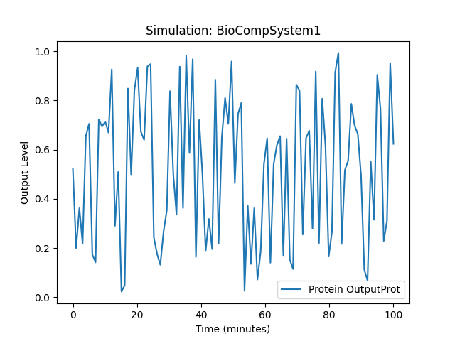
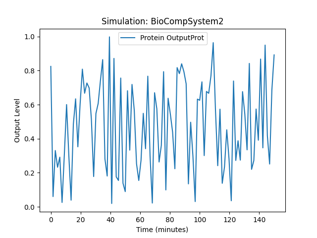
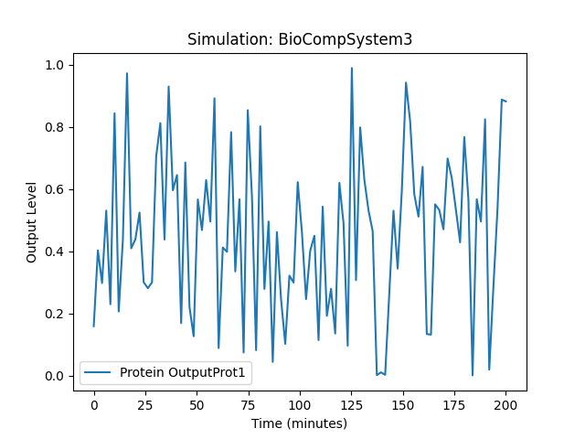
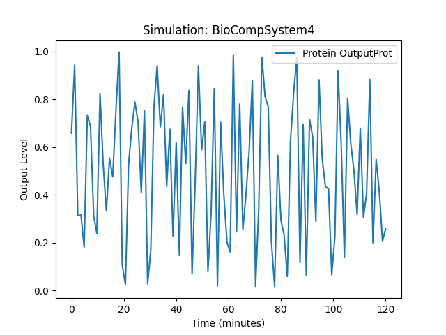

# biocomp - python based DSL for biocomputing

Propozycja języka domenowo-specyficznego (DSL) do edukacji i wdrażania biocomputingu mogłaby obejmować elementy języka opisu eksperymentów, symulacji, designu i utrzymania systemów biokomputerowych. 
BioDSL posiada jasną i intuicyjną składnię, umożliwiającą tworzenie i uruchamianie eksperymentów oraz analizę wyników.


### Składnia

Główne składniki BioDSL obejmują:
1. **Definicje Molekularne**
2. **Tworzenie Biologicznych Układów Logicznych**
3. **Symulacje Eksperymentów**
4. **Drukowanie i Inżynieria BioSystemów**
5. **Monitorowanie i Utrzymanie Systemów**


Python code with respective classes and logic for creating instances and processing them. Then, we'll create a YAML file containing the parameters for those instances. Finally, we'll write the Python script to parse the YAML file and execute the corresponding functions.


## START

### Zaleznosci

1. **`pyparsing`**: Biblioteka do parsowania, potrzebna do przetwarzania DSL.
2. **`matplotlib`**: Biblioteka do tworzenia wizualizacji, użyta do generowania wykresów wyników symulacji.
3. **`numpy`**: Biblioteka do operacji na tablicach wielowymiarowych, używana do generowania danych do symulacji.

Aby zainstalować te wymagania w swoim środowisku Python, wykonaj następujące kroki:

#### Stwórz i aktywuj wirtualne środowisko:
```bash
python -m venv env
source env/bin/activate  # Na Windows użyj: env\Scripts\activate
```
 
####  Zainstaluj zależności z pliku `requirements.txt`:
```bash
pip install -r requirements.txt
pip install --upgrade pip
```

### Execution Script

To run this setup, follow these steps:

1. Save the Python code in a file named `biocomp.py`.
2. Save the YAML content in a file named `biocomp.yaml`.
3. Execute the Python script from the command line, providing the YAML file as an argument:

```sh
python biocomp.py 1.biocomp.yaml
```


The output should be something like:

```
Running simulation for BioCompSystem1
Conditions: {'time': 100, 'temperature': 37}
Expected Outputs: ['Protein OutputProt']
```


This setup parses the YAML file, creates the necessary objects, and runs the simulation based on the parameters provided in the YAML file.


## More Samples

These examples include various configurations of molecules, logic gates, and simulation conditions.
Assuming you have implemented `AND`, `OR`, and `NOT` gate logic in your actual `LogicGate` class, these should yield appropriate outputs based on the conditions set in each YAML file.
Examples can handle various gate types (`AND`, `OR`, `NOT`). 
If not, you'll need to add the logic for these gate types in your `LogicGate` class implementation.

To test your script with these examples, save each YAML configuration as separate files 

```sh
python biocomp.py 2.biocomp.yaml
```

```yaml
Running simulation for BioCompSystem2
Conditions: {'time': 150, 'temperature': 25}
Expected Outputs: ['Protein OutputProt']
```


```sh
python biocomp.py 3.biocomp.yaml
```

```yaml
Running simulation for BioCompSystem3
Conditions: {'time': 200, 'temperature': 30}
Expected Outputs: ['Protein OutputProt1', 'Protein OutputProt2']
```

```sh
python biocomp.py 4.biocomp.yaml
```

```yaml
Running simulation for BioCompSystem4
Conditions: {'time': 120, 'temperature': 37}
Expected Outputs: ['Protein OutputProt']
```


I see the issue. For the NOT gate, the `input2` field is not required and should be handled differently in the code. Let's update both the YAML example and the Python script to handle the NOT gate correctly.

### Updated YAML Example
For the NOT gate simulation, omit the `input2` field entirely.

```yaml
# simulation4.yaml

molecules:
  - type: Protein
    name: Input1Prot
  - type: Protein
    name: OutputProt

logic_gates:
  - gate_type: NOT
    input1: Input1Prot
    output: OutputProt

biological_system:
  name: BioCompSystem4

simulation:
  conditions:
    time: 120
    temperature: 37
  outputs:
    - Protein OutputProt
```

### Updated Python Code
Modify the `LogicGate` class and the logic where logic gates are parsed to handle NOT gates correctly.

```python
```

### Running the Updated Example

To test the updated example, execute the script with the `simulation4.yaml` file as an argument:

```sh
python bio_simulation.py simulation4.yaml
```

This should now handle the NOT gate correctly and output:

```
Running simulation for BioCompSystem4
Conditions: {'time': 120, 'temperature': 37}
Expected Outputs: ['Protein OutputProt']
```

This revised script now properly handles cases where a logic gate does not require a second input, such as in the case of a NOT gate.


## Menu

+ [edit](https://github.com/biokomputer/dsl/edit/main/README.md)
+ [project](https://github.com/biokomputer/dsl)


